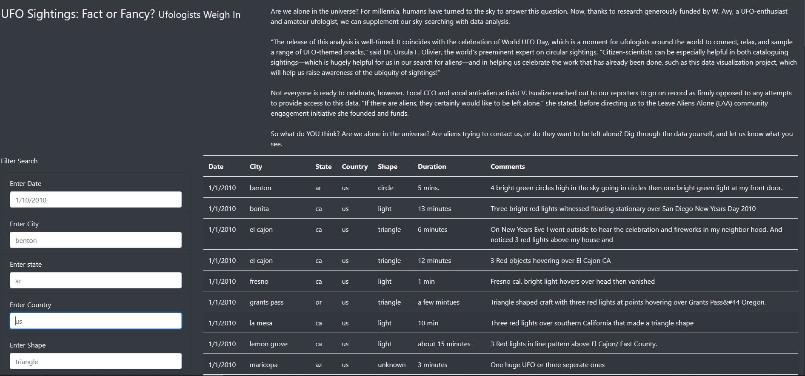

# UFOs

## Overview of the analysis
We are creating a webpage which creates a dynamic table to organize UFO data that is stored as a JavaScript array, or list. This table will have the ability to filter data based on certain criteria and will be created using JavaScript as the primary coding language.

## Results

The webpage cerated shares some information about UFO sightings, and provides a table with some filtering fields to zoom in on specific sightings.

Users can filter the presented table with either date, city, state, country or shape, which are all present on the left side of the page. The table will auto-populate the rows based on available data and input. If anyone wants to see the whole table, they just need to refresh the page.

## Summary

In summary, it can be really argued that there is life out there or these are all our imagination on a grand scale. However, one drawback of this webpage can be said that all sighting is based on just two weeks of information, so there can lots more out there.

Further development ideas for this website can be as follows:

- Take in user data for sightings along with source (web article, video etc),
- Show an interactive map for locations and zoom in as user filters the table.